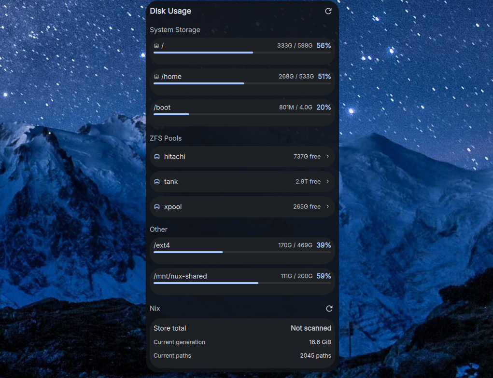

# DankDiskUsage

A bar widget plugin for [DankMaterialShell](https://github.com/AvengeMedia/DankMaterialShell) that monitors disk, ZFS pool, and Nix store usage with smart mount classification and expandable detail.



## Features

- Smart mount priority: system paths (/, /home, /nix, /var, /boot) are shown prominently in "System Storage"
- Bar pill shows the most important mount's usage percentage
- ZFS datasets grouped by pool with expandable detail views
- Nix store total size on demand, plus current NixOS generation path count and closure size
- Color-coded usage bars with configurable warning/critical thresholds
- Excludes tmpfs, devtmpfs, overlay, and fuse mounts automatically

## Installation

### Nix (flake)

Add as a `flake = false` input and include in your DMS plugin configuration:

```nix
inputs.dms-plugin-diskusage = {
  url = "github:alcxyz/DankDiskUsage";
  flake = false;
};
```

```nix
programs.dank-material-shell.plugins.dankDiskUsage = {
  enable = true;
  src = inputs.dms-plugin-diskusage;
};
```

### Manual

Copy the plugin directory to `~/.config/DankMaterialShell/plugins/DankDiskUsage/`.

## Settings

The Nix section refreshes current generation closure details automatically. The full `/nix/store` size is cached and only rescanned when you click the Nix section refresh button, because walking the whole store can be expensive.

| Setting | Default | Description |
|---------|---------|-------------|
| Refresh interval | 30s | How often to poll disk usage data |
| Warning threshold | 80% | Usage percentage for yellow indicator |
| Critical threshold | 95% | Usage percentage for red indicator |
| Show partitions | true | Display non-ZFS, non-system filesystems |
| Show ZFS pools | true | Group ZFS datasets by pool with expandable detail |
| Show Nix info | true | Display cached store size plus current generation closure details |
| Excluded mountpoints | [] | Mountpoints to hide from the display |

## License

MIT

<details>
<summary>Support</summary>

- **BTC:** `bc1pzdt3rjhnme90ev577n0cnxvlwvclf4ys84t2kfeu9rd3rqpaaafsgmxrfa`
- **ETH / ERC-20:** `0x2122c7817381B74762318b506c19600fF8B8372c`
</details>
