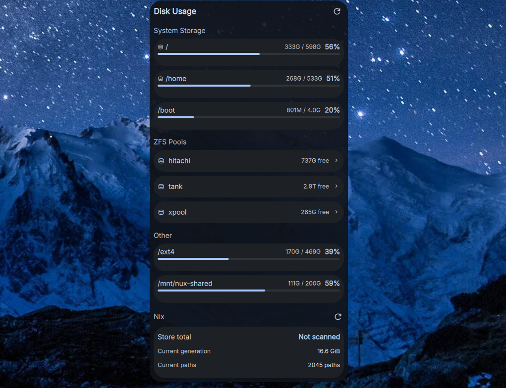

# DankDiskUsage

A bar widget plugin for [DankMaterialShell](https://github.com/AvengeMedia/DankMaterialShell) that monitors disk, ZFS pool, and Nix store usage with smart mount classification and expandable detail.



## Features

- Smart mount priority: system paths (/, /home, /nix, /var, /boot) are shown prominently in "System Storage"
- Bar pill shows the most important mount's usage percentage
- ZFS datasets grouped by pool with expandable detail views
- Btrfs subvolumes of one filesystem grouped into a single expandable volume, so shared capacity is counted once instead of once per mountpoint
- Optional same-device merging for the remaining filesystems (bind mounts, volumes mounted twice)
- Mergerfs pools shown as expandable **Merged Storage** cards, with `df` usage for mapped member filesystems
- USB and removable drives shown in a separate **External Drives** section
- Network shares (NFS, SMB, SSHFS, and rclone) shown as independent mount rows
- Nix store total size on demand, plus current NixOS generation path count and closure size
- Color-coded usage bars with configurable warning/critical thresholds
- Excludes tmpfs, devtmpfs, overlay, and plain `fuse` mounts automatically
- User-defined exclusions for mountpoints and ZFS datasets, with `*` wildcard support

## Installation

### Nix (flake)

Add as a `flake = false` input and include in your DMS plugin configuration:

```nix
inputs.dms-plugin-diskusage = {
  url = "github:alcxyz/DankDiskUsage";
  flake = false;
};
```

```nix
programs.dank-material-shell.plugins.dankDiskUsage = {
  enable = true;
  src = inputs.dms-plugin-diskusage;
};
```

### Manual

Copy the plugin directory to `~/.config/DankMaterialShell/plugins/DankDiskUsage/`.
For an identifiable development build, stage `dist/dev` first and copy
`dist/dev/share/dms-plugins/DankDiskUsage/` instead of the raw checkout.

## Settings

By default, the Nix section refreshes current generation closure details automatically. The full `/nix/store` disk usage is cached and only rescanned when you click the Nix section refresh button.

An optional [background collector](docs/collector.md) refreshes registered Nix object sizes on a user timer, including while the widget is closed. Enable **Use background collector** after installing and enabling the helper. Registered size is logical NAR metadata, separate from scanned disk usage; the widget only reads the cached snapshot in this mode.

`df` can report several Btrfs mountpoints with the same filesystem-wide usage.
**Group Btrfs subvolumes** presents that capacity once and keeps the mountpoint list
expandable. **Merge mountpoints sharing a device** optionally collapses other repeated
device rows; GNU `df` already omits ordinary duplicate bind mounts in many cases.
Grouping conservatively recognizes sources under `/dev/`; pseudo sources, ZFS datasets,
network shares, and paths outside `/dev/` remain separate. See
[ADR-006](docs/adr/ADR-006-device-aware-mount-grouping.md).

**Local Filesystems** replaces the previous “Other” section and shows the filesystem
type on each row. **Show local filesystems** controls remaining local rows and
internal Btrfs groups without system mounts. Groups containing
priority mounts such as `/` or `/home` stay visible. Changes to grouping, visibility,
and exclusions apply to the latest disk snapshot as soon as settings reload, without
waiting for the next disk poll.

**Show external drives** controls USB and removable block devices, such as a drive
mounted at `/media/usb`, independently.
Optional `lsblk` metadata identifies a device by USB transport or removable status and
follows that classification through partitions and mapped devices. USB SSDs remain
external even when the kernel does not mark them removable. Missing or invalid metadata
leaves the filesystem in its ordinary local or Btrfs section. Device classification
updates on disk polls or manual refresh; it does not watch hotplug events. `df` remains
the source of capacity and usage, and `lsblk` runs once per disk poll when available.

**Show merged storage** displays mergerfs pool capacity from `df`. When available,
optional `getfattr` metadata maps branch paths to member filesystem `df` usage; this
metadata lookup does not scan files. Pool capacity remains visible if the attribute
or a member mapping is unavailable. Member rows represented by a pool are removed
from **Local Filesystems**, while priority system mounts remain visible. `attr` and coreutils
`timeout` enable member details.

**Show network shares** displays NFS, SMB, SSHFS, and rclone mounts separately,
with their protocol and source. Their capacities are not aggregated. Other FUSE
mounts are not treated as network shares. See
[ADR-007](docs/adr/ADR-007-merged-and-network-storage.md) for classification and
member mapping rules.

| Setting | Default | Description |
|---------|---------|-------------|
| Refresh interval | 30s | How often to poll disk usage data |
| Warning threshold | 80% | Usage percentage for yellow indicator |
| Critical threshold | 95% | Usage percentage for red indicator |
| Show local filesystems | true | Display remaining local filesystems and non-system Btrfs volumes |
| Show external drives | true | Show detected USB and removable drives in a separate section |
| Show ZFS pools | true | Group ZFS datasets by pool with expandable detail |
| Group Btrfs subvolumes | true | Merge subvolumes of one Btrfs filesystem into a single expandable volume |
| Show merged storage | true | Show mergerfs pools and mapped member filesystem usage |
| Show network shares | true | Show supported network mounts as independent rows |
| Merge mountpoints sharing a device | false | Collapse the remaining same-device mountpoints into one row with a `+N mounts` badge |
| Show Nix info | true | Display cached store size plus current generation closure details |
| Use background collector | false | Read Nix metadata from the optional scheduled helper |
| Excluded mountpoints or datasets | [] | Mountpoints or ZFS datasets to hide; supports `*` wildcards such as `/run/user/1000/*` |

+## Development builds

The tracked manifest keeps the release version. To stage an identifiable
development package, run:

```bash
python3 scripts/package.py --output dist/dev
```

This produces a manifest version like `X.Y.Z-dev.<commit>`; a dirty checkout
adds `.dirty`. For Nix, use `pkgs.callPackage ./default.nix { revision = ...; }`.
Release packaging is guarded and requires a clean checkout at the exact
`vX.Y.Z` tag.

## License

MIT

<details>
<summary>Support</summary>

- **BTC:** `bc1pzdt3rjhnme90ev577n0cnxvlwvclf4ys84t2kfeu9rd3rqpaaafsgmxrfa`
- **ETH / ERC-20:** `0x2122c7817381B74762318b506c19600fF8B8372c`
</details>
